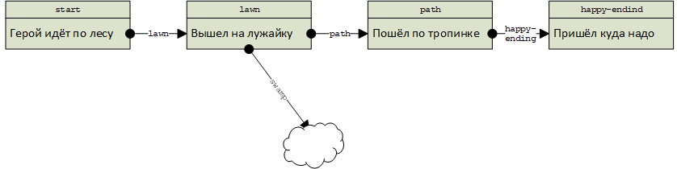

# Как устроены истории



Она рассказывает, как всё устроено, что умеет бот и зачем он это умеет. О том, как всё это _сделать_, рассказано в
следующих статьях.



Тихозвериный бот рассказывает **истории**. Истории бывают разные — это может быть сказка, игра, приключение, экскурсия,
головоломка или вовсе что-то такое, что и названия-то не имеет.

У каждой истории есть **название**, которое ей даёт автор. Двух историй с одинаковыми названиями быть не может.

Рассказывание истории — это интерактивный процесс. Бот отправляет человеку тексты, картинки, видео, загадки и прочее, а
человек делает выбор кнопками, сам пишет в ответ текст и так далее.

Всё, что бот отправляет залпом между действиями человека, называется **страницей**.

История может состоять из любого количества страниц, даже из одной — правда, в такой истории не будет места интерактиву,
бот просто что-то расскажет и всё.

Стартовая страница всегда одна, а вот финальных страниц может быть несколько.

## Как страницы связаны друг с другом

У каждой страницы есть идентификатор. Автор истории может придумать страницам любые идентификаторы за исключением самой
первой страницы, с которой бот начинает рассказ, — она должна иметь идентификатор `start`.

Страницы связаны друг с другом **направлениями**, которые задаёт автор. Направление — это просто идентификатор страницы,
которую бот должен прочитать следующей.

Рассмотрим пример — историю «Утро Ивана Николаевича».

Вот страница `start`, которой автор назначил направление `coffee`:

Бот читает человеку эту страницу и ждёт его ответа. Человек отвечает:

Тогда бот находит страницу `coffee` и читает её:

И так до самого конца истории:

### Истории можно (и нужно!) делать нелинейными

В примере выше у каждой страницы есть только одно направление — прочитав страницу `start`, бот может перейти только на
страницу `coffee`.

Таких направлений может быть несколько — читатель решает, куда отправиться дальше, с помощью кнопочного меню.

Автор сам определяет, какие кнопки надо показать пользователю и на какую страницу истории его приведёт каждая из них.
Например, на скриншоте выше бот показал читателю страницу `town`. Автор задал для неё два направления: если читатель
нажмёт **Идти к площади**, он попадёт на страницу `square`, а если **Идти к Носовому Маяку** — на страницу `lighthouse`.

### Какие ошибки подстерегают автора нелинейных историй

Проектируя запутанную (то есть интересную!) историю, легко случайно запрограммировать ситуацию, из которой бот и
читатель не могут выбраться.



Получив новую историю, бот проверяет, нет ли в ней подобных ошибок. Если они есть, он не принимает историю и просит
автора её исправить.



#### Безвыходный цикл

Нельзя создавать в истории кольцо, из которого нет выхода.

Если герой этой истории, стоя на лужайке, решит влезть в болото, он не сможет из него выбраться и добраться до финальной
страницы. Бот и читатель будут вечно ходить по одним и тем же сообщениям и одним и тем же кнопкам.

Чтобы цикл перестал быть безвыходным, нужно сделать из него выход:

Теперь герой сможет, побарахтавшись, выбраться на тропинку, а не на кочку.

#### Направления на несуществующие страницы

Когда автор пишет страницу, он может сразу задать все направления — в том числе на страницы, которые ещё не написаны.
Если история большая, очень легко забыть сделать страницу, на которую ссылается одна из уже сделанных страниц.

#### Страницы, до которых нельзя добраться

В истории не должно быть страниц, заведомо недоступных читателю.

Если сделать, как показано на схеме, герой не сможет попасть на болото. Для героя это хорошо, но болото будет зря
занимать место в базе данных бота.

Разумеется, это не значит, что читатель должен непременно посетить все страницы за одно прочтение.

## Как устроена страница

Страница состоит из **реплик** — то есть отправляемых ботом отдельных сообщений. Например, страницы на самом первом
скриншоте в этой статье состоят одна из четырех, а вторая из трёх реплик.

### Виды реплик

Бот умеет отправлять читателю много видов реплик — поддерживается не всё, что есть в Телеграме, но многое.

Страница может состоять из любых реплик в любых комбинациях.

#### Текст

Самый простой вариант реплики — бот просто отправляет текст. Поддерживаются переносы строк и оформление болдом,
курсивом, зачёркнутым и подчёркнутым.

#### Случайный текст

Автор придумывает для такой реплики несколько вариантов текста, и бот отправляет случайный вариант.

#### Картинка

Бот отправляет читателю картинку — обычным способом, со сжатием. Подпись задавать можно, в том числе случайную.
Форматирование в подписи поддерживается.

#### Оригинал картинки

Это полезно, если вы художник и нарисовали что-то классное и детальное. Помните, что отправленные таким способом
картинки до скачивания выглядят так:

#### Викторина

Стандартная телеграммовская с правильным ответом. Пока работает не без ограничений: для каждого читателя бот заводит
новую копию викторины и не собирает ответы.

#### Стикер

Бот может отправить читателю стикер. Так можно, например, награждать эксклюзивным стикерпаком тех, кто нашёл сокровище.

### Настройки реплики

Реплику любого типа можно настроить.

#### Пауза

Компьютеры и сеть работают очень быстро, поэтому бот может отправлять сообщения молниеносно — фактически всю страницу
разом. Это может помешать читателю погрузиться в историю и даже привести к тому, что он пропустит часть реплик.

Поэтому автор может задать паузу для каждой реплики — например, более длинную для длинных и более короткую для коротких.

Не переусердствуйте: если сделать паузы слишком длинными, читатель решит, что бот завис.

#### Вознаграждение артефактом

Автор может в любой реплике на любой странице вознаградить читателя **артефактом**. Например, выдать ему артефакт
«монета», артефакт «золотой ключ» или что угодно ещё.

Например, бот отправляет читателю картинку и вместе с ней — артефакт.



Сама по себе выдача артефакта читателю не видна. Если вы хотите, чтобы он о ней узнал, напишите об этом в тексте
реплики. Например: «Вы получили монету».



Артефакт сохраняется у пользователя, пока он читает историю. Если он получит артефакт, дочитает и начнёт заново,
артефакта у него уже не будет.

#### Условия показа реплики

Бот может показывать или не показывать конкретную реплику в зависимости от того, есть ли у человека конкретный артефакт.

Например, вы можете написать две реплики:

* Спустившись в подвал, вы увидели великолепный закрытый сундук.
* В подвале стоит уже обысканный вами сундук.

И показывать одну или другую в зависимости от того, есть ли у читателя артефакт «сокровище из сундука».



Воспринимайте артефакты как метки, которые позволяют вам показывать или не показывать реплики в зависимости от того,
каким путём шёл читатель.



