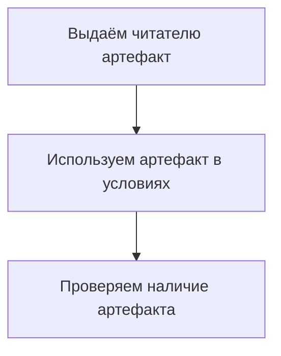

# Статья про артефакты

**Артефакты** позволяют сохранять во время рассказа истории **объекты**, которые могут быть использованы в различных условиях отображения поинтов и кнопок.

Например, можно выдавать артефакты читателю, которые могут влиять на ход истории. Артефакты могут быть необходимыми для выполнения определённых действий или могут быть ограничены в использовании.

Принцип работы артефактов похож на принцип работы счётчиков.





После прохождения истории артефакты могут сохраняться для дальнейшего использования.



## Выдача и обновление артефакта {#new-artifact}

Артефакт выдаётся читателю в блоке `reward`. Это делается с помощью элемента `artifact`:

```xml
<point>
    <text>
        <string>В этом поинте мы добавляем читателю артефакт с идентификатором "key".</string>
    </text>
    <reward>
        <artifact id="key" global="true"/>
    </reward>
</point>
```

Элемент `artifact` содержит два обязательных атрибута:

#|
||Атрибут|Тип данных|Смысл||
||
id
|
Строка
| 
Идентификатор нужен для последующих проверок наличия артефакта.
||
||
global
|
`true` или `false`
|
Определяет, будет ли артефакт доступен глобально или только в рамках текущей истории.
||
|#

Значение выданного читателю артефакта можно проверять в условиях:

```xml
<point>
    <prerequisites>
        <needed-artifacts>
            <artifact id="key"/>
        </needed-artifacts>
    </prerequisites>
    <text>
        <string>Этот поинт будет показан, если читатель имеет артефакт "key".</string>
    </text>
</point>
```

## Использование артефактов в условиях показа {#using-artifacts}

Артефакты используются в условиях показа поинтов и кнопок. Например, если артефакт выдан, выводится одно сообщение, а если нет — другое.

Принцип проверки похож на тот, что используется для счётчиков, но механика более простая: артефакт либо существует, либо не существует.

### Устройство артефактов {#artifacts-structure}

Артефакты проверяются в блоке `prerequisites`. Необходимые артефакты помещаются в блок `needed-artifacts`, а запрещённые — в блок `restricted-artifacts`.

Например:

```xml
<point>
    <prerequisites>
        <needed-artifacts>
            <artifact id="key"/>
        </needed-artifacts>
    </prerequisites>
    <text>
        <string>Этот поинт будет показан, если читатель имеет артефакт "key".</string>
    </text>
</point>
<point>
    <prerequisites>
        <restricted-artifacts>
            <artifact id="forbidden-item"/>
        </restricted-artifacts>
    </prerequisites>
    <text>
        <string>Этот поинт не будет показан, если читатель имеет артефакт "forbidden-item".</string>
    </text>
</point>
```



Если артефакт не может быть найден (например, в нём указан несуществующий артефакт), он учитывается так же, как если бы артефакт не был выдан.


