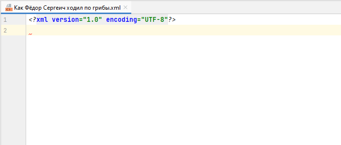
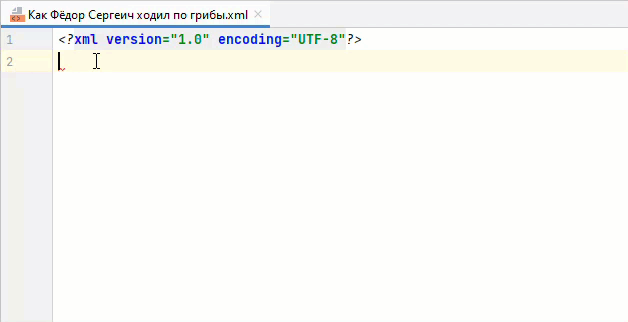
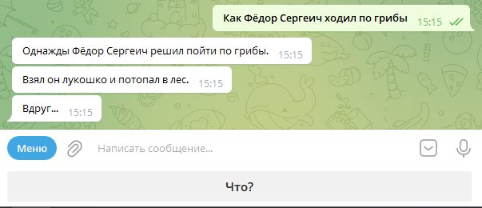

# Как писать историю

## Заголовок

Любой XML-файл начинается с **заголовка**, вот такого:

```xml
<?xml version='1.0' encoding='UTF-8'?>
```

Он технический, не обращай на него внимания, а просто скопируй в свой файл, чтобы он стал первой строчкой.

Получится так:



## Корневой элемент `<tiche-zvire-story>`

Сразу после заголовка начинается сама история. Её границы обозначаются тегом `<tiche-zvire-story>`.



Если ты не понимаешь, что такое тег, прочти объяснение под катом в начале этой статьи.



У него есть обязательный атрибут `xmlns`, поэтому целиком элемент будет выглядеть так:

```xml
<tiche-zvire-story xmlns="http://tichezvire.ru">
   
</tiche-zvire-story>
```

`xlmns` указывает, что мы собираемся писать историю для тихозвериного бота и соблюдать все правила составления таких
историй.

Поставь курсор в строку 2 и начни писать тег. «Идея» узнает его и сразу предложит помощь.



В файле появилось много новых недоделанных тегов. Все они нам понадобятся. Можно не вникать во все теги сразу, потому
что дальше мы отдельно рассмотрим каждый из них. Но на всякий случай вот краткие пояснения:

```xml
<?xml version='1.0' encoding='UTF-8'?>
<tiche-zvire-story xmlns="http://tichezvire.ru"> <!-- Здесь начинается история. -->
    <title></title> <!-- Сюда мы напишем заголовок истории -->
    <page id=""> <!-- Здесь начинается первая страница -->
        <points> <!-- Points — это реплики бота, входящие в первую страницу. -->
            <point> <!-- Здесь начинается первая реплика. -->
                < <!-- Здесь мы напишем содержание первой реплики. -->
            </point> <!-- Здесь заканчивается первая реплика -->
        </points> <!-- Здесь заканчивается описание реплик, входящих в первую страницу -->
        < <!-- Здесь будут направления -->
    </page> <!-- Здесь заканчивается первая страница -->
</tiche-zvire-story> <!-- Здесь заканчивается история -->
```



Обрати внимание: в этом примере объяснения помещены в `<!-- -->`. Это так называемые **комментарии** — они видны людям,
но не помешают боту читать файл. Используй комментарии на своё усмотрение.



## Название истории — `<title>`

Тег с названием истории идёт первым. Названию хорошо быть недлинным и внятным.



❌ история 1

❌ qwerty12345

❌ занимательнейшее повествование в котором герой претерпевает две тысячи четыреста восемьдесят одно приключение и
счастливый но довольный женится на принцессе

✅ Сказка о рыбаке и рыбке

✅ Московский квест

✅ Повесть о том, как поссорился Иван Иванович с Иваном Никифоровичем



Придумав название, запиши ему между открывающим и закрывающим тегом:

```xml
<title>Как Фёдор Сергеич ходил по грибы</title>
```

## Страницы истории — `<page>`

Сразу после `<title>` идёт тег `<page>`. «Идея» автоматически добавила один — это будет первая страница. Так как она
первая впиши ей **id** `start`.



Если ты не знаешь, как устроены истории и что такое страницы и реплики, прочти [предыдущую статью](../stories.md).



Получится так:

```xml
<?xml version='1.0' encoding='UTF-8'?>
<tiche-zvire-story xmlns="http://tichezvire.ru">
    <title>Как Фёдор Сергеич ходил по грибы</title>
    <page id="start">
        <points>
            <point>
                <
            </point>
        </points>
        <
    </page>
</tiche-zvire-story>
```

## Реплики — `<points>`

Основное содержание страницы — реплики, которые бот отправляет читателю. Все реплики хранятся внутри тега `<points>`,
каждая из них представлена отдельным тегом `<point>`.

Опробуем для начала самый простой вариант реплики — обычный текст. Вот как это сделать:

```xml
<?xml version='1.0' encoding='UTF-8'?>
<tiche-zvire-story xmlns="http://tichezvire.ru">
    <title>Как Фёдор Сергеич ходил по грибы</title>
    <page id="start">
        <points>
            <point>
                <text>
                    <string>Однажды Фёдор Сергеич решил пойти по грибы.</string>
                </text>
            </point>
        </points>
        <
    </page>
</tiche-zvire-story>
```

Добавим ещё одну:

```xml
<?xml version='1.0' encoding='UTF-8'?>
<tiche-zvire-story xmlns="http://tichezvire.ru">
    <title>Как Фёдор Сергеич ходил по грибы</title>
    <page id="start">
        <points>
            <point>
                <text>
                    <string>Однажды Фёдор Сергеич решил пойти по грибы.</string>
                </text>
            </point>
            <point>
                <text>
                    <string>Взял он лукошко и потопал в лес.</string>
                </text>
            </point>
        </points>
        <
    </page>
</tiche-zvire-story>
```

В третьей добавим интриги:

```xml
<?xml version='1.0' encoding='UTF-8'?>
<tiche-zvire-story xmlns="http://tichezvire.ru">
    <title>Как Фёдор Сергеич ходил по грибы</title>
    <page id="start">
        <points>
            <point>
                <text>
                    <string>Однажды Фёдор Сергеич решил пойти по грибы.</string>
                </text>
            </point>
            <point>
                <text>
                    <string>Взял он лукошко и потопал в лес.</string>
                </text>
            </point>
            <point>
                <text>
                    <string>Вдруг...</string>
                </text>
            </point>
        </points>
        <
    </page>
</tiche-zvire-story>
```

На этом первую страницу закончим.

## Направления — `<directions>`

Осталось добавить странице направление — чтобы бот показал читателю кнопку, открывающую следующую страницу. За
направления отвечают элементы `<direction>`, которые, как и реплики, собраны внутри элемента `<directions>`.

`direction` выглядит так:

```xml
<direction>
    <button>Дальше!</button> <!-- Тут указывается текст кнопки, которую увидит читатель -->
    <next-page>bear</next-page> <!-- А тут — идентификатор страницы, на которую кнопка его отправит -->
</direction>
```

В истории о Фёдоре Сергеиче `<direction>` будет выглядеть так:

```xml
<?xml version='1.0' encoding='UTF-8'?>
<tiche-zvire-story xmlns="http://tichezvire.ru">
    <title>Как Фёдор Сергеич ходил по грибы</title>
    <page id="start">
        <points>
            <point>
                <text>
                    <string>Однажды Фёдор Сергеич решил пойти по грибы.</string>
                </text>
            </point>
            <point>
                <text>
                    <string>Взял он лукошко и потопал в лес.</string>
                </text>
            </point>
            <point>
                <text>
                    <string>Вдруг...</string>
                </text>
            </point>
        </points>
        <directions>
            <direction>
                <button>Что?</button>
                <next-page>bear</next-page>
            </direction>
        </directions>
    </page>
</tiche-zvire-story>
```

Для читателя созданная нами первая страница будет выглядеть так:



## Завершение истории — `<end/>`

Теперь нужно создать страницу, на которую отправляет читателя первая страница. Для этого нужно просто вставить ещё один
элемент `<page>` с соответствующим идентификатором.

Сделаем эту страницу финальной — чтобы история на ней закончилась. Такая страница обозначается элементом `<end/>`,
который вставляется вместо `<directions>`.

```xml
<?xml version='1.0' encoding='UTF-8'?>
<tiche-zvire-story xmlns="http://tichezvire.ru">
    <title>Как Фёдор Сергеич ходил по грибы</title>
    <page id="start">
        <points>
            <point>
                <text>
                    <string>Однажды Фёдор Сергеич решил пойти по грибы.</string>
                </text>
            </point>
            <point>
                <text>
                    <string>Взял он лукошко и потопал в лес.</string>
                </text>
            </point>
            <point>
                <text>
                    <string>Вдруг...</string>
                </text>
            </point>
        </points>
        <directions>
            <direction>
                <button>Что?</button>
                <next-page>bear</next-page>
            </direction>
        </directions>
    </page>
    <page id="bear">
        <points>
            <point>
                <text>
                    <string>Вдруг на Фёдора Сергеича выпрыгнул огромный медведь!</string>
                </text>
            </point>
            <point>
                <text>
                    <string>Испугался Фёдор Сергеич и что есть духу помчался домой, все грибы растерявши, конечно.</string>
                </text>
            </point>
        </points>
        <end/>
    </page>
</tiche-zvire-story>
```