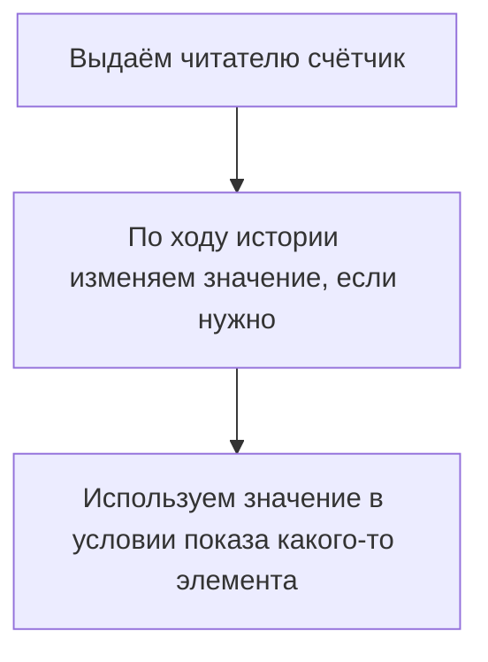

# Статья про счётчики

**Счётчики** позволяют сохранять во время рассказа истории **числа**, а затем использовать их как условия отображения поинтов и кнопок.

Например, можно вести подсчёт каких-то событий в истории и в конце выводить разные вердикты в зависимости от их количества. Счётчики можно сравнивать друг с другом — чтобы определить, например, каких действий человек сделал больше: добрых или злых.

Принцип работы счётчиков похож на принцип работы артефактов.





После прохождения истории все значения сбрасываются.



## Выдача и обновление счётчика {#new-counter}

Как и артефакт, счётчик выдаётся читателю в блоке `reward`. Это делается с помощью элемента `counter`:

```xml
<point>
    <text>
        <string>В этом поинте мы добавляем читателю счётчик и записываем в него число 5.</string>
    </text>
    <reward>
        <counter id="points" operation="put" value="5"/>
    </reward>
</point>
```

Элемент `counter` содержит три обязательных атрибута:

#|
||Атрибут|Тип данных|Смысл||
||
id
|
Строка
|
Идентификатор нужен для последующих изменений значений счётчика и для использования в условиях
||
||
operation
|
`put`, `increment`, `decrement`
|
- `put` — поместить значение `value` в счётчик;
- `increment` — прибавить значение `value` к счётчику;
- `decrement` — вычесть значение `value` из счётчика.
||
||
value
|
Целое число
|
Значение, которое нужно поместить в счётчик, прибавить к нему или отнять.
||
|#

Значение выданного читателю счётчика можно обновлять: прибавлять к нему числа и вычитать их из него, например:

```xml
<point>
    <text>
        <string>В этом поинте мы увеличиваем значение счётчика на 3, чтобы получилось 8.</string>
    </text>
    <reward>
        <counter id="points" operation="increment" value="3"/>
    </reward>
</point>
<point>
    <text>
        <string>А теперь вычитаем 2, чтобы получилось 6.</string>
    </text>
    <reward>
        <counter id="points" operation="decrement" value="2"/>
    </reward>
</point>
<point>
    <text>
        <string>А здесь читатель потерял все очки, сколько бы их ни было.</string>
    </text>
    <reward>
        <counter id="points" operation="put" value="0"/>
    </reward>
</point>
```





На неё можно поначалу не обращать внимания.



Будет создан счётчик со значением 0, а затем к нему прибавлено или от него отнято соответствующее число.

То есть `increment` на несуществующем счётчике даёт то же, что и `put`, а `decrement` — собственный `value` с обратным знаком. Такое поведение полезно для запихивания всей логики подсчёта очков в один поинт — как демо-истории. 



## Использование счётчиков в условиях показа {#using-counters}

Смысл любого счётчика в том, что он используется в условиях показа поинтов и кнопок. Например, если набрано меньше пяти очков, выводится одно сообщение, а от пяти и выше — другое.

Принцип проверки похож на тот, что используется для артефактов, но механика более сложная: если артефакт может либо существовать, либо не существовать, то значение счётчика нужно _сравнивать_ с каким-то другим числом.

Такое сравнение производят элементы, называемые **компараторами**. Каждый компанатор содержит в себе неравенство и отвечает «да», если оно верное и «нет», если оно неверное.

### Устройство компараторов {#comparators}

Компараторы бывают двух видов: `numerical-comparator` сравнивает значение счётчика с числом, а `counter-comparator` — со значением другого счётчика.

```xml
<!-- Этот компаратор проверяет, набраны ли пять очков: -->
<numerical-comparator counter-id="points" comparison="greater-or-equal" value="5">

<!-- Этот компаратор проверяет, было ли белых шаров больше, чем чёрных: -->
<counter-comparator counter-id="white-balls" comparison="greater" value-from="black-balls">
```



- Атрибуты numerical-comparator

    #|
    ||Атрибут|Тип данных|Смысл||
    ||
    counter-id
    |
    Строка
    |
    Идентификатор счётчика, значение которого мы собираемся сравнивать.
    ||
    ||
    comparison
    |
    `greater`, `greater-or-equal`, `less`, `less-or-equal`, `equal`
    |
    Какое условие должно быть выполнено:

    - `greater` — значение счётчика больше, чем число;
    - `greater-or-equal` — значение счётчика больше числа или равно ему;
    - `less` — значение счётчика меньше, чем число.
    - `less-or-equal` — значение счётчика меньше числа или равно ему;
    - `equal` — значение счётчика равно числу.
    ||
    ||
    value
    |
    Целое число
    |
    Число, с которым нужно сравнить значение счётчика.
    ||
    |#


- Атрибуты counter-comparator

    #|
    ||Атрибут|Тип данных|Смысл||
    ||
    counter-id
    |
    Строка
    |
    Идентификатор счётчика (**счётчик A**), значение которого мы собираемся сравнивать.
    ||
    ||
    comparison
    |
    `greater`, `greater-or-equal`, `less`, `less-or-equal`, `equal`
    |
    Какое условие должно быть выполнено:

    - `greater` — значение **счётчика A** больше, чем значение **счётчика Б**;
    - `greater-or-equal` — значение **счётчика A** больше значения **счётчика Б** или равно ему;
    - `less` — значение **счётчика A** меньше, чем значение **счётчика Б**;
    - `less-or-equal` — значение **счётчика A** меньше значения **счётчика Б** или равно ему;
    - `equal` — значение **счётчика A** равно значению **счётчика Б**.
    ||
    ||
    value-from
    |
    Строка
    |
    Идентификатор счётчика (**счётчик Б**), с которым мы сравниванием значение первого счётчика.
    ||
    |#





Если компаратор не может выполнить своё сравнение (например, в нём указан несуществующий счётчик), он учитывается так же, как если бы сравнение было неверным.



### Использование компараторов {#comparators-in-action}

Компараторы проверяются там же, где артефакты — в блоке `prerequisites`. Необходимые компараторы помещаются в блок `needed-comparators`, а запрещённые — в блок `restricted-comparators`.

Например:

```xml
<point>
    <prerequisites>
        <needed-comparators>
            <numerical-comparator counter-id="points" comparison="greater-or-equal" value="1"/>
            <numerical-comparator counter-id="points" comparison="less-or-equal" value="3"/>
        </needed-comparators>
    </prerequisites>
    <text>
        <string>Этот поинт будет показан, если читатель набрал от 1 до 3 очков.</string>
    </text>
</point>
<point>
    <prerequisites>
        <restricted-comparators>
            <numerical-comparator counter-id="points" comparison="greater-or-equal" value="4"/>
            <numerical-comparator counter-id="points" comparison="less-or-equal" value="10"/>
        </restricted-comparators>
    </prerequisites>
    <text>
        <string>Этот поинт не будет показан, если читатель набрал от 4 до 10 очков.</string>
    </text>
</point>
```

#### Взаимодействие условий друг с другом {#comparator-interaction}



Если их получается очень много, лучше попытаться изменить устройство истории — например, сделать несколько поинтов вместо одного очень сложного.



Финальный вердикт `prerequisites` определяется в таком порядке:

1. Вначале определяется, что даёт каждый из компараторов: «да» или «нет».
2. Затем определяется, что даёт блок `needed-comparators`: он даёт зелёный свет, если все компараторы внутри дают «да».
3. Затем определяется, что даёт блок `restricted-comparators`: он даёт зелёный свет, если все компараторы внутри дают «нет».
4. Если в оба блока дают зелёный свет, поинт или кнопка отображается.

Например, у нас есть вот такие `prerequisites`:

```xml
<prerequisites>
    <needed-comparators>
        <numerical-comparator counter-id="points" comparison="greater-or-equal" value="1"/>
        <numerical-comparator counter-id="points" comparison="less-or-equal" value="10"/>
    </needed-comparators>
    <restricted-comparators>
        <numerical-comparator counter-id="points" comparison="greater-or-equal" value="4"/>
        <numerical-comparator counter-id="points" comparison="less-or-equal" value="7"/>
    </resctricted-comparators>
</prerequisites>
```

Пусть значение счётчика равно **2**.



- Шаг 1

    Вначале проверятся каждое из условий:

    ```xml
    <prerequisites>
        <needed-comparators>
            <numerical-comparator counter-id="points" comparison="greater-or-equal" value="1"/> <!-- YES -->
            <numerical-comparator counter-id="points" comparison="less-or-equal" value="10"/> <!-- YES -->
        </needed-comparators>
        <restricted-comparators>
            <numerical-comparator counter-id="points" comparison="greater-or-equal" value="4"/> <!-- NO -->
            <numerical-comparator counter-id="points" comparison="less-or-equal" value="7"/> <!-- YES -->
        </resctricted-comparators>
    </prerequisites>
    ```

- Шаг 2

    Затем — что получается на «светофорах» `needed-comparators` и `resctricted-comparators`:

    ```xml
    <prerequisites>
        <needed-comparators> <!-- 🟢 -->
            <numerical-comparator counter-id="points" comparison="greater-or-equal" value="1"/> <!-- YES -->
            <numerical-comparator counter-id="points" comparison="less-or-equal" value="10"/> <!-- YES -->
        </needed-comparators>
        <restricted-comparators> <!-- 🟢 -->
            <numerical-comparator counter-id="points" comparison="greater-or-equal" value="4"/> <!-- NO -->
            <numerical-comparator counter-id="points" comparison="less-or-equal" value="7"/> <!-- YES -->
        </resctricted-comparators>
    </prerequisites>
    ```

- Шаг 3


    Так как оба дают зелёный свет, поинт или кнопка отобразится:

    ```xml
    <prerequisites>  <!-- ✅ -->
        <needed-comparators> <!-- 🟢 -->
            <numerical-comparator counter-id="points" comparison="greater-or-equal" value="1"/> <!-- YES -->
            <numerical-comparator counter-id="points" comparison="less-or-equal" value="10"/> <!-- YES -->
        </needed-comparators>
        <restricted-comparators> <!-- 🟢 -->
            <numerical-comparator counter-id="points" comparison="greater-or-equal" value="4"/> <!-- NO -->
            <numerical-comparator counter-id="points" comparison="less-or-equal" value="7"/> <!-- YES -->
        </resctricted-comparators>
    </prerequisites>
    ```




Теперь рассмотрим случай, если на счётчике **5**.



- Шаг 1

    Вначале проверятся каждое из условий:

    ```xml
    <prerequisites>
        <needed-comparators>
            <numerical-comparator counter-id="points" comparison="greater-or-equal" value="1"/> <!-- YES -->
            <numerical-comparator counter-id="points" comparison="less-or-equal" value="10"/> <!-- YES -->
        </needed-comparators>
        <restricted-comparators>
            <numerical-comparator counter-id="points" comparison="greater-or-equal" value="4"/> <!-- YES -->
            <numerical-comparator counter-id="points" comparison="less-or-equal" value="7"/> <!-- YES -->
        </resctricted-comparators>
    </prerequisites>
    ```

- Шаг 2

    Затем — что получается на «светофорах» `needed-comparators` и `resctricted-comparators`:

    ```xml
    <prerequisites>
        <needed-comparators> <!-- 🟢 -->
            <numerical-comparator counter-id="points" comparison="greater-or-equal" value="1"/> <!-- YES -->
            <numerical-comparator counter-id="points" comparison="less-or-equal" value="10"/> <!-- YES -->
        </needed-comparators>
        <restricted-comparators> <!-- 🔴 -->
            <numerical-comparator counter-id="points" comparison="greater-or-equal" value="4"/> <!-- YES -->
            <numerical-comparator counter-id="points" comparison="less-or-equal" value="7"/> <!-- YES -->
        </resctricted-comparators>
    </prerequisites>
    ```

- Шаг 3


    Так как на одном из «светофоров» красный, поинт или кнопка не проходит:

    ```xml
    <prerequisites>  <!-- ❌ -->
        <needed-comparators> <!-- 🟢 -->
            <numerical-comparator counter-id="points" comparison="greater-or-equal" value="1"/> <!-- YES -->
            <numerical-comparator counter-id="points" comparison="less-or-equal" value="10"/> <!-- YES -->
        </needed-comparators>
        <restricted-comparators> <!-- 🟢 -->
            <numerical-comparator counter-id="points" comparison="greater-or-equal" value="4"/> <!-- NO -->
            <numerical-comparator counter-id="points" comparison="less-or-equal" value="7"/> <!-- YES -->
        </resctricted-comparators>
    </prerequisites>
    ```

