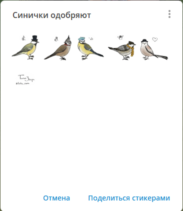

# Типы реплик бота

Бот может отправлять читателю реплики разного типа — текст, картинки, стикеры, викторины и так далее.

В [руководстве по сборке истории](build-basic-story.md) в качестве примера используются реплики с простым текстом, вот
такие:

```xml
<point>
    <text>
        ...
    </text>
</point>
```

Вместо них можно вставить любые другие в любом порядке. Каждый тип реплики вставляется с помощью своего тега. Например,
у картинки вместо `<text>` будет `<image>`, у стикера `<sticker>` и так далее.

## Случайные группы поинтов {#random-group}

Атрибут `random group` позволяет объединять несколько поинтов в одну группу, из которой будет случайным образом показан один поинт. Это полезно, когда нужно разнообразить контент, показывая разные варианты одного и того же сообщения.

### Пример использования random group

```xml
<point random-group="greeting">
    <text>
        <string>Здравствуйте!</string>
    </text>
</point>
<point random-group="greeting">
    <text>
        <string>Привет!</string>
    </text>
</point>
<point random-group="greeting">
    <text>
        <string>Дратути!</string>
    </text>
</point>
```

В этом примере три поинта имеют одинаковое значение `random-group="greeting"`. При показе истории бот случайным образом выберет один из этих поинтов для отображения.


## Текст

Сам текст реплики записывается так:

```xml
<point>
    <text>
        <string>Жил-был на свете гусь.</string>
    </text>
</point>
```

Чтобы сделать перенос строки внутри одного сообщения, нужно использовать сочетание знаков `$%`:

```xml
<point>
    <text>
        <string>Жил-был на свете гусь.$%Очень хороший гусь с красивым клювом и круглым пузиком.</string>
    </text>
</point>
```

Чтобы телеграм не просто перенёс текст, а оставил пустую строчку, нужно повторить это два раза:

```xml
<point>
    <text>
        <string>Жил-был на свете гусь.$%$%Очень хороший гусь с красивым клювом и круглым пузиком.</string>
    </text>
</point>
```

Текст можно **форматировать**. Каждый кусочек форматирования задаётся отдельным элементом `<accentuation>`. Таких
элементов можно добавить сколько угодно — например, если нужно одно слово выделить курсивом, а другое подчеркнуть.

Например, чтобы выделить жирным гуся, нужно написать так:

```xml
<point>
    <text>
        <string>Жил-был на свете гусь.</string>
        <accentuations>
            <accentuation type="b" offset="17" length="4"/>
        </accentuations>
    </text>
</point>
```

### Что к чему в этом примере

`type` задаёт тип форматирования:

| Код        | Формат       |
|------------|--------------|
| `type="b"` | Болд         |
| `type="i"` | Курсив       |
| `type="s"` | Зачёркнутый  |
| `type="u"` | Подчёркнутый |

`offset` задаёт номер буквы, с которой начинается кусочек, который нужно отформатировать. Обратите внимание: первая
буква имеет номер 0, а не 1!


`length` задаёт длину кусочка, который нужно отформатировать.

### Что важно иметь в виду

* Одну и ту же букву можно форматировать хоть всеми четырьмя способами — Телеграм умеет показывать
  жирно-курсивно-подчёркнуто-зачёркнутый текст.
* Перенос считается за **один знак** — учитывайте это, расставляя числа.
* Следи за тем, чтобы указанный кусочек **не выходил за правую границу текста**. Бот не проверяет корректность
  форматирования, когда принимает историю, а телеграм откажется отправлять сообщение с ошибкой.

## Случайный текст

Боту можно задать несколько вариантов текста реплики, чтобы он случайно выбрал любой из них. Это делается с помощью
элемента `random-text`, который содержит элементы `text` — такие же, как описаны выше.

```xml
<point>
    <random-text>
        <text>
            <string>Здравствуйте!</string>
        </text>
        <text>
            <string>Дратути</string>
        </text>
        <text>
            <string>Здорово!</string>
        </text>
        <text>
            <string>Привет!</string>
        </text>
    </random-text>
</point>
```

## Картинка

Чтобы добавить в историю картинку, нужно положить её куда-нибудь в интернет так, чтобы она была доступна по прямой
ссылке. Найти такое место оказалось не так просто. Я
использую [сервис Яндекс Облако](https://console.cloud.yandex.ru/folders/b1g0052uvs9tag5k5vd1/storage/buckets/tiche-zvire),
ты тоже можешь его попробовать.

Чтобы добавить картинку в историю, нужно написать так:

```xml
<point>
    <image>https://storage.yandexcloud.net/tiche-zvire/image-12.png</image>
</point>
```

Бот скачает картинку по указанному адресу и сохранит у себя в базе данных.

Чтобы отправить картинку с подписью, воспользуйся элементом `text`:

```xml
<point>
    <image>https://storage.yandexcloud.net/tiche-zvire/image-12.png</image>
    <text>
        <string>Подпись к картинке.</string>
    </text>
</point>
```

## Картинка без сжатия

Чтобы бот отправил человеку оригинал картинки, нужно вместо `image` использовать `original-image`:

```xml
<point>
    <original-image>https://storage.yandexcloud.net/tiche-zvire/image-12.png</original-image>
</point>
```

Подпись к картинке без сжатия добавлять нельзя.

## Викторина

Чтобы добавить викторину, используй элемент `<poll>`. Он устроен так:

```xml
<point>
    <poll>
        <question>Кто самое великолепное и благородное животное?</question>
        <answers>
            <correct-answer>Конь</correct-answer>
            <wrong-answer>Кит</wrong-answer>
            <wrong-answer>Илья</wrong-answer>
            <wrong-answer>Чак-Чак</wrong-answer>
        </answers>
    </poll>
</point>
```

## Стикер

Чтобы бот отправил человеку стикер, используй элемент `<sticker>`. Он устроен так:

```xml
<point>
    <sticker pack="sinichki_with_love" emoji="👍"/>
</point>
```

Обрати внимание: в атрибуте `path` указывается не название, а **идентификатор** пака. Чтобы его получить, воспользуйся
функцией **Поделиться стикерами**:



Эта кнопка отправит в буфер обмена ссылку, правая часть которой — это как раз идентификатор пака:

`https://t.me/addstickers/sinichki_with_love`



Чтобы бот мог отправлять стикер читателям, ему нужно этот стикер вначале от кого-то получить. Донт аск, так устроен
телеграм.

Добавив стикер в историю, сразу отправь его боту сообщением.


