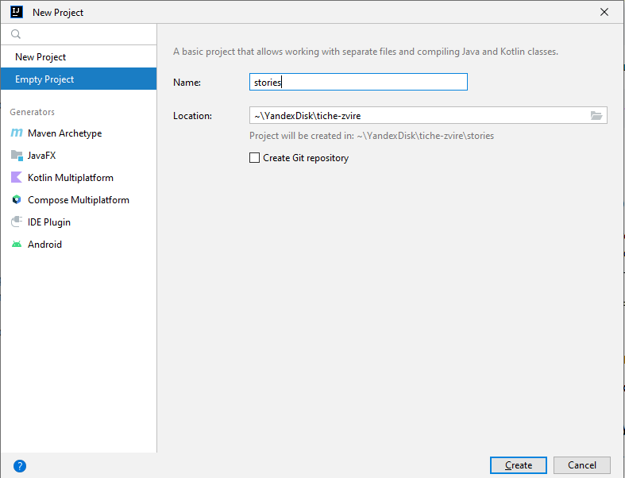
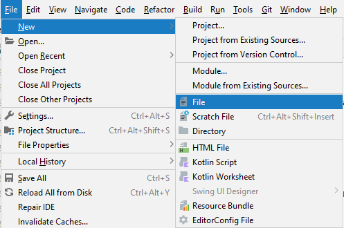
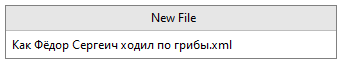

# Как подготовиться к написанию истории

Технически писать историю для бота можно в любом текстовом редакторе — например, в «Блокноте». Если всё сделать
правильно, история, написанная в «Блокноте», будет работать. Но это неудобно, потому что «Блокнот» не сможет проверить,
всё ли правильно оформлено.

Поэтому лучше использовать специальную программу, которая поможет соблюсти все правила ботьего языка. Она называется
«Идея».

## Шаг 1. Скачай InrelliJ IDEA

Открой [сайт](https://www.jetbrains.com/ru-ru/idea/), нажми **Скачать** и выбери версию **Community**. Установи «Идею» и
запусти её.

## Шаг 2. Создай пустой проект

Выбери **File** → **New** → **Project...**

Откроется окно создания проекта, выбери в нём **Empty Project**.

Напиши какое-нибудь понятное название и задай папку, где будут храниться истории.

## Шаг 3. Скачай файл с правилами ботьего языка

Он не для тебя, а для «Идеи». Благодаря файлу с правилами программа будет знать, как должна быть устроена история — и
подскажет тебе, если ты что-то сделаешь не так.

Скачай файл и положи его в папку с проектом.

[Скачать tiche-zvire-story.xsd](../tiche-zvire-story.xsd)

## Шаг 4. Создай файл, в котором будешь писать историю

Вернись в «Идею». Выбери **File** → **New** → **File**

Придумай имя файла и запиши его с расширением _xml_:

Написал имя файла, нажми **Enter**. Всё готово, можно писать историю!