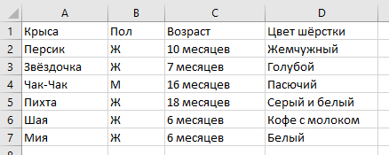

# Несколько слов об XML

Представим, что у нас есть таблица какими-то данными:

| Крыса     | Пол | Возраст    | Цвет шёрстки   |
|-----------|-----|------------|----------------|
| Персик    | Ж   | 10 месяцев | Жемчужный      |
| Звёздочка | Ж   | 7 месяцев  | Голубой        |
| Чак-Чак   | М   | 16 месяцев | Пасючий        |
| Пихта     | Ж   | 18 месяцев | Серый и белый  |
| Шая       | Ж   | 6 месяцев  | Кофе с молоком |
| Мия       | Ж   | 6 месяцев  | Белый          |

Мы хотим эту таблицу хранить, пересылать по интернету и так далее. Если у нас есть **Microsoft Excel**, хранить таблицу
проще простого. Мы заполняем ячейки и готово:



Но Эксель — это сложный формат, который не всегда доступен. Для создания и чтения xlsx-файлов нужно иметь специальную
программу.

А текстовый формат всегда доступен, универсален, дёшев и так далее. Поэтому важно уметь, грубо говоря, кодировать
таблицы в текстовом формате. Чтобы красиво, наглядно, однозначно и так далее.

Для этого в текст добавляют служебные структурирующие элементы. Они, грубо говоря, показывают, где начинаются и
заканчиваются ячейки таблицы. Эти пометки называются **разметкой**.

Одним из способов решить эту задачу — записывать таблицы в виде текста — и является язык XML. Не самым современным и не
самым модным, но совершенно работоспособным. Я выбрал его не за какие-то особенные достоинства, а просто потому, что он
используется у нас на работе.

Основной и узнаваемый элемент языка XML — тег. Теги записываются с помощью кавычек-уголков и обособляют в тексте
элемент, имеющий определённый смысл.

Вот как это выглядит:

```xml
<rat-name>Персик</rat-name>
```

Слева стоит **открывающий тег**. Он обозначает, что нечто — в данном случае имя крысы — тут начинается. Справа стоит *
*закрывающий тег** — он обозначает, что имя крысы закончилось. В некотором смысле теги похожи на таблички с названиями
населённых пунктов на трассах — вначале проезжаешь табличку с названием, а затем табличку с перечёркнутым названием.

Внутри XML-элемента может быть не просто какое-то текстовое содержание, а другие XML-элементы. Например, вот как может
выглядеть полное описание крысы:

```xml
<rat>
    <name>Персик</name>
    <sex>Ж</sex>
    <age>10</age>
    <hue>жемчужный</hue>
</rat>
```

Это, в общем, вся суть языка XML.

Осталось только одно техническое дополнение: у тега могут быть **атрибуты**. Атрибуты записываются **внутрь**
открывающего тега. С применением атрибутов крысу на языке XML можно описать так:

```xml
<rat name="Персик" sex="Ж" age="10" hue="жемчужный"></rat>
```

**— Так как правильно, с атрибутами или как в начале?**

Оба способа правильные. Их можно комбинировать:

```xml
<rat name="Персик">
    <sex>Ж</sex>
    <age>10</age>
    <hue>жемчужный</hue>
</rat>
```

Все эти три варианта описания крысы Персика на языке XML правильны.

Вся табличка таким образом может выглядеть так:

```xml
<rats>
    <rat name="Персик">
        <sex>Ж</sex>
        <age>10</age>
        <hue>жемчужный</hue>
    </rat>
    <rat name="Звёздочка">
        <sex>Ж</sex>
        <age>7</age>
        <hue>голубой</hue>
    </rat>
    <rat name="Чак-Чак">
        <sex>М</sex>
        <age>16</age>
        <hue>пасючий</hue>
    </rat>
    <rat name="Пихта">
        <sex>Ж</sex>
        <age>18</age>
        <hue>серый и белый</hue>
    </rat>
    <rat name="Шая">
        <sex>Ж</sex>
        <age>6</age>
        <hue>кофе с молоком</hue>
    </rat>
    <rat name="Мия">
        <sex>Ж</sex>
        <age>6</age>
        <hue>белый</hue>
    </rat>
</rats>
```

Если между открывающим и закрывающим тегом ничего нет, их можно записать коротко, вот так:

```xml
<rat name="Персик" sex="Ж" age="10" hue="жемчужный"/>
```